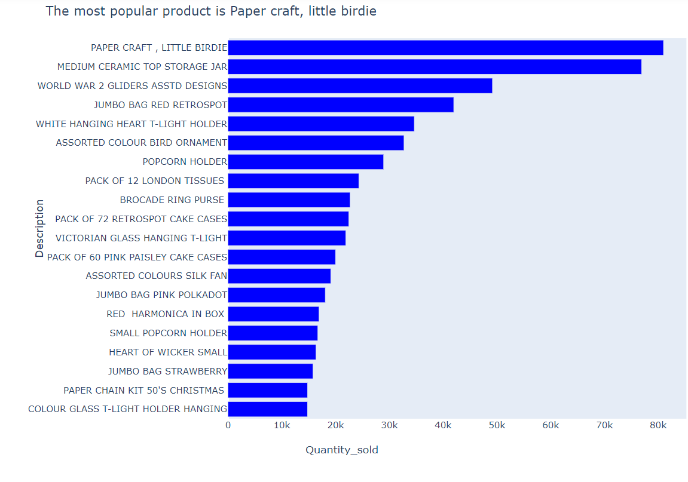

# Network-Analysis
Network Analysis of Online Products
## Project title: Network Analysis of Products from an Online UK retailer.

### Author: [Tola Ogunniyi](https://www.linkedin.com/in/tolaogunniyi/)
----

### Date completed: May 13, 2020.

### Introduction:
This is a transnational data set of a UK-based and registered non-store online retail. 
The company sells unique all-occasion gifts and majority of the
customers are wholesalers. Data was gathered between 01/12/2010 and 09/12/2011.

### Dataset
Source of dataset is Kaggle [Kaggle](https://www.kaggle.com/carrie1/ecommerce-data).
This is a transnational data set of a UK-based and registered non-store online retail. The company sells unique all-occasion gifts and majority of the
customers are wholesalers. Data was gathered between 01/12/2010 and 09/12/2011.

----
### Jupyter notebook 
The project will be completed using a jupyter notebook that consists of 2 parts viz:

### Part 1: 
 (i) Preprocessing and cleaning (ii) Exploratory data analysis

### Part 2: 
 Modelling which will involve the use of a Market Basket Analysis to learn different rules (associations) between products sold. 

 ----
 ### Visualizations in the dataset
The charts provided below are included as an image file with links attached. Plotly express was used to create both charts as part 
of the exploratory data analysis phase of the project.

 Figure 1-Top 20 products sold by the UK online retailer

  

 Figure 2- Bar chart showing the sales amount grouped by countries

  

### References
- https://gephi.org/users/quick-start/

### Future work based on the dataset
 - Use a market basket analysis approach to determine the nodes and edges for use in Network analysis based on the dataset.
